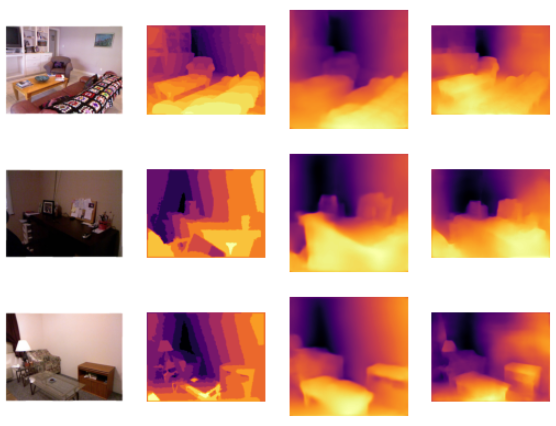
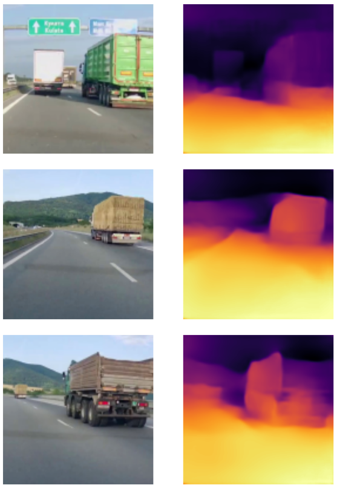
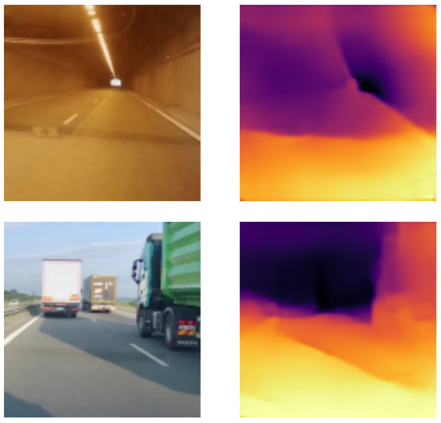
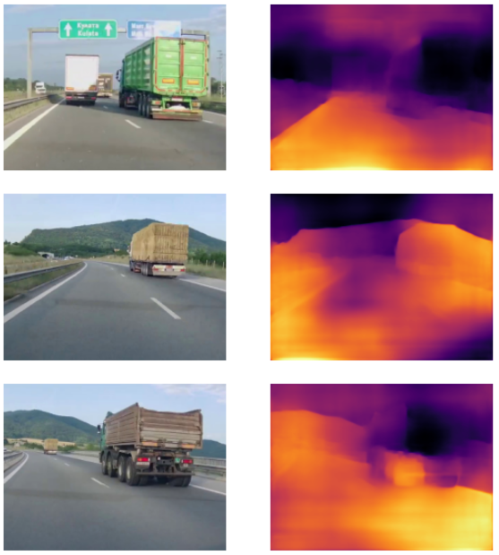
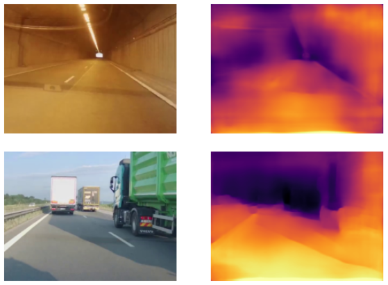

# Depth Estimation with TensorFlow

This repository contains Python code and Jupyter Notebooks which are supposed to be able to train CNNs which can predict depth from a single input image. The input image is supposed to be from a real world driving scene.

The source code is a modified and extended version of the code in this GitHub repository [siddinc/monocular_depth_estimation](https://github.com/siddinc/monocular_depth_estimation). It is based on those two researches [U-Net: Convolutional Networks for Biomedical Image Segmentation](https://arxiv.org/abs/1505.04597) and [High Quality Monocular Depth Estimation via Transfer Learning](https://arxiv.org/abs/1812.11941).

## TensorFlow Installation on Windows Native

Installation of TensorFlow 2.10 is as described here: [https://www.tensorflow.org/install/pip](https://www.tensorflow.org/install/pip):

0. Install the current NVIDIA drivers for your GPU (RTX 3050 Ti Laptop GPU was used).
1. Install Anaconda.
2. Create a new virtual environment in Anaconda with **Python 3.9.18** for the TensorFlow 2.10.
3. Install CUDA: `conda install -c conda-forge cudatoolkit=11.2 cudnn=8.1.0`.
4. Install **TensorFlow 2.10** with pip within the virtual environment: `python -m pip install "tensorflow<2.11"`.
5. Install Jupyter: `conda install jupyter`.
6. Install with pip the rest of the packages for OpenCV, etc., when Python gives you the "Module Not Found Error".
7. You can check the GPU availability with the [gpu_test.ipynb](gpu_test.ipynb) notebook.

## Dataset

The used dataset is **NYU Depth V2**. It can be downloaded from kaggle: [https://www.kaggle.com/datasets/soumikrakshit/nyu-depth-v2](https://www.kaggle.com/datasets/soumikrakshit/nyu-depth-v2) (4GB).

After extraction of the files of the dataset you need to regenerate the dataset CSV files for training and test data. Please, take a look at the [make_dataset.ipynb](make_dataset.ipynb).

## Training

Take a look at the Jupyter Notebooks [train_resnet.ipynb](train_resnet.ipynb) and [train_unet.ipynb](train_unet.ipynb). They are creating CNN models and are performing training over the test data. The first one uses ResNet34 image classification model which can be applied also for the task of depth estimation when considering NYU Depth V2 dataset. The second notebook is creating a custom U-Net. The U-Net in the original repository is slightly different from the one in the paper.

When using U-Net the expected image size is 320x240. There were problems with the training if the images ware resized to 128x128. This should be further investigated. The bigger image requires a lot more time for training since a single laptop grade GPU is used. This was the reason for which a subset for the dataset is used for the U-Net training. The ResNet34 is trained with the full NYU Depth V2 dataset.

For the training the dataset was reduced to 20000 images for train set and 5000 for the validation set. The number of the epochs was set to 10. The ResNet32 required an average execution time of 195.40 seconds for a single epoch and 128x128 images. The model when saved as a keras file is 132.2 MB. The U-Net required an average execution time of 1205.40 seconds for a single epoch and 320x240 images. The model when saved as keras file is 373.8 MB.

After the training the models are saved to a keras files which can be loaded for a prediction.

## Prediction

For the prediction there are again two Jupyter Notebooks [predict_resnet.ipynb](predict_resnet.ipynb) and [predict_unet.ipynb](predict_unet.ipynb). The code is identical but with different values for the image dimensions. The two notebooks are given for an easier comparison of the results. You are required to set the correct path to the train data and the correct model filename. The U-Net CNN still does not work as good as the ResNet34. This might be due to the problems with the training. In the original repository the results are better, so, this should be further investigated.

There is also a Jupyter Notebook [compare_two_models.ipynb](compare_two_models.ipynb) which gives side by side comparison of the U-Net and ResNet on the same images. The comparison is shown in Fig. 1.

| 
| -
| **Fig. 1.** ResNet34 vs U-Net comparision. Columns: 1 - input image, 2 - depth ground truth, 3 - ResNet34 model prediction, 4 - U-Net model prediction.

## Experiments with Real World Outdoor Images

The next goal was to try a simple test with a real images. The required outdoor scene was an automobile road. For the experiments another Jupyter Notebooks are created: [predict_resnet_real_images.ipynb](predict_resnet_real_images.ipynb) and [predict_unet_real_images.ipynb](predict_unet_real_images.ipynb). The test images are in the following directory [real_photos](./real_photos/).

The first experiment was with the trained ResNet34 model. The ResNet34 was trained on an indoor dataset but still can achieve good results when predicts depth of an outdoor scenes as it can be seen in Fig. 2. Good predictions are achieved when the illumination is uniform and there are no shadows or light reflections.

| 
| -
| **Fig. 2.** ResNet34 predictions of normal images. Columns: 1 - input image, 2 - ResNet34 model prediction.

However, when images with a lot of shadows of non-uniform light are predicted by the model, it can bbe seen that the depth information is not predicted correctly as shown in Fig. 3. The depth in the tunnel image is wrongly estimated due to a reflection on the windshield of the car. The depth outside of the tunnel is wrongly estimated due the the big shadow of the truck.

| 
| -
| **Fig. 3.** ResNet34 predictions of images with shadows and reflections. Columns: 1 - input image, 2 - ResNet34 model prediction.

The second experiment was with the U-Net model trained on the same NYU Depth V2 dataset. The results from the single image depth estimation are shown in Fig. 4.

| 
| -
| **Fig. 4.** U-Net predictions of normal images. Columns: 1 - input image, 2 - U-Net model prediction.

The U-Net model has a minor advantage over the ResNet when the tunnel image is considered. However, when the depth of the image with the shadow on road is estimated with U-Net the results are comparable or even worse than the estimations of the ResNet as shown in Fig. 5.

| 
| -
| **Fig. 5.** U-Net predictions of images with shadows and reflections. Columns: 1 - input image, 2 - U-Net model prediction.

In conclusion, both approaches are suitable for images with a uniform illumination and with a minor post-processing than can be used for depth estimation of a driving scene. But, if a more general scene is considered, e.g., with light reflections, shadows, etc., there should be done pre-processing of the image or the CNNs must be trained with a different (and/or augmented) dataset.

## Future Work

1. To fix the U-Net CNN, maybe try with more epochs or a completely different structure.
2. To try a different parameters for the U-Net Training Loss Function.
3. To investigate what is the corespondence between the U-Net parameters and the image dimensions.
4. To try a different ResNets.
5. To save model after each epoch and compare the predictions.
6. To train with the KITTI dataset.
7. To investigate how the dataset can be augmented with added shadows and reflections.
8. To investigate how the shadows and illuminations can be eliminated with a pre-processing, either with a regular image processing (pre-2012 methods) or with a specifically designed CNN (post-2012 methods).
9. To create a new dataset suitable for real world outdoor scene by using data from a stereo depth camera.
10. To design a suitable CNN model for the dataset with non-uniform light, shadows, light reflections, mild and severe fog or rain conditions.
11. To conduct real world experiments with the selected, designed and trained models.
12. To compare the designed model with the ones from the papers and the original repository and even with [Monodepth2](https://github.com/nianticlabs/monodepth2).

> [!WARNING]  
> This is still a Work In a Progress type of repository. It contains code from [siddinc/monocular_depth_estimation](https://github.com/siddinc/monocular_depth_estimation) which is with GPLv3 license. The same license is applied to this repository. The attained results should not be related to those from the aforementioned repository.